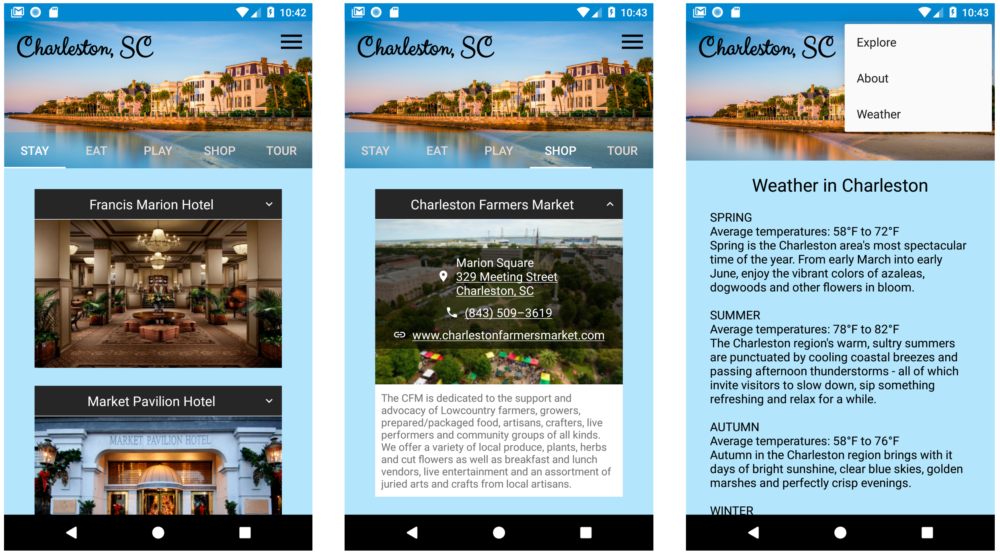

## Grow With Google Android Basics Nanodegree: PROJECT 5
# Charleston Tour Guide - Tourism App

Used **API 27: Android 8.1 (Oreo)**

## Screenshots

## About
This project is a tour guide app for Charleston, SC that provides information about the city, including restaurants, hotels, things to do, places to shop, and more.

## Features
- Use of fragments to display lists of information by topic
- Collapsing menu for each item, with autolinks for phone, web, and map.
